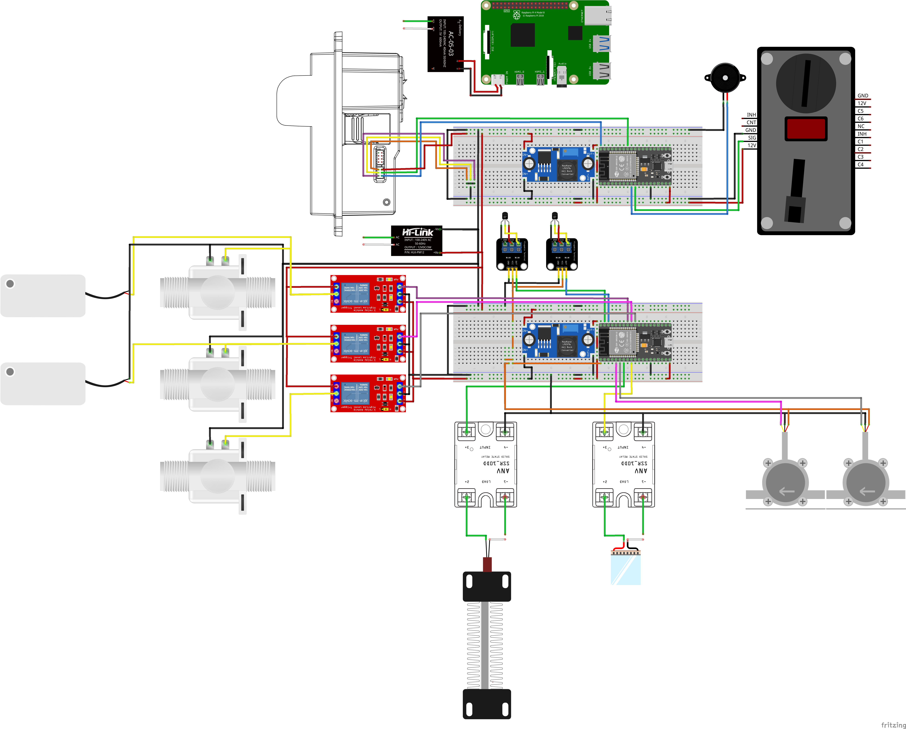

## Author / Credits

Developed and maintained by [qppd](https://github.com/qppd)
# Water Dispenser Vending Machine

[](https://www.arduino.cc/)
[](https://isocpp.org/)
[](https://www.python.org/)
[](https://github.com/TomSchimansky/CustomTkinter)
[](https://www.raspberrypi.org/)
[](https://opensource.org/licenses/MIT)
[](https://github.com/qppd/water-dispenser-vendo)
[](https://github.com/qppd/water-dispenser-vendo/releases)

A smart water dispenser vending machine project built on ESP32 microcontroller, featuring coin and bill acceptance, audio feedback, and automated dispensing.

## Table of Contents

- [Features](#features)
- [Hardware Requirements](#hardware-requirements)
- [Software Requirements](#software-requirements)
- [Project Structure](#project-structure)
- [Installation](#installation)
- [Configuration](#configuration)
- [Usage](#usage)
- [Wiring](#wiring)
- [API Reference](#api-reference)
- [Troubleshooting](#troubleshooting)
- [Contributing](#contributing)
- [License](#license)

## Features

- **Coin Acceptance**: Supports multiple coin denominations (P1, P5, P10, P20) via ALLAN coin slot
- **Bill Acceptance**: Accepts Philippine bills (P20, P50, P100) using TB-74 bill acceptor
- **Credit Management**: Accumulates credits from coins and bills
- **Audio Feedback**: Piezo buzzer provides tones for user interactions
- **Automated Dispensing**: Relay-controlled water dispensing when sufficient credit is reached
- **Serial Monitoring**: Real-time feedback via serial console
- **Interrupt-Driven**: Efficient pulse counting for accurate denomination detection

## Hardware Requirements

- ESP32 Development Board
- ALLAN Coin Slot (pulse-based)
- TB-74 Bill Acceptor (pulse-based)
- Piezo Buzzer
- Relay Module (for water pump/valve control)
- Power Supply (appropriate for ESP32 and peripherals)
- Connecting Wires and Breadboard (for prototyping)

### Pin Configuration

| Component | ESP32 Pin | Description |
|-----------|-----------|-------------|
| Coin Slot | GPIO 4 | Interrupt pin for coin pulses |
| Bill Acceptor | GPIO 26 | Interrupt pin for bill pulses |
| Buzzer | GPIO 27 | PWM output for audio feedback |
| Relay | GPIO 23 | Digital output for dispensing control |

## Software Requirements

- Arduino IDE 1.8.x or later
- ESP32 Board Support Package
- Arduino ESP32 Core

### Dependencies

- Arduino.h (included with ESP32 core)
- Standard C++ libraries

## Project Structure

```
water-dispenser-vendo/
├── LICENSE
├── README.md
├── diagrams/          # Circuit diagrams and schematics
├── models/           # 3D models or CAD files
├── src/
│   └── esp/
│       └── ESPWDVClient/
│           ├── ESPWDVClient.ino    # Main Arduino sketch
│           ├── PINS_CONFIG.h       # Pin definitions
│           ├── COIN_SLOT.h         # Coin slot interface
│           ├── COIN_SLOT.cpp       # Coin slot implementation
│           ├── BILL_ACCEPTOR.h     # Bill acceptor interface
│           ├── BILL_ACCEPTOR.cpp   # Bill acceptor implementation
│           ├── BUZZER_CONFIG.h     # Buzzer interface
│           ├── BUZZER_CONFIG.cpp   # Buzzer implementation
│           └── RELAY_CONFIG.h      # Relay interface
│           └── RELAY_CONFIG.cpp    # Relay implementation
└── wiring/            # Wiring instructions and guides
```

## Installation

1. **Clone the Repository**
   ```bash
   git clone https://github.com/qppd/water-dispenser-vendo.git
   cd water-dispenser-vendo
   ```

2. **Install Arduino IDE**
   - Download and install Arduino IDE from [arduino.cc](https://www.arduino.cc/en/software)

3. **Install ESP32 Board Support**
   - Open Arduino IDE
   - Go to File > Preferences
   - Add `https://dl.espressif.com/dl/package_esp32_index.json` to Additional Board Manager URLs
   - Go to Tools > Board > Boards Manager
   - Search for "ESP32" and install the package

4. **Open the Project**
   - Open `src/esp/ESPWDVClient/ESPWDVClient.ino` in Arduino IDE
   - Select your ESP32 board from Tools > Board
   - Select the correct COM port

5. **Upload the Code**
   - Click the Upload button in Arduino IDE

## Configuration

### Pin Configuration

Modify `PINS_CONFIG.h` to change pin assignments:

```cpp
// Coin Slot
#define coinPin 4

// Bill Acceptor
#define billPin 26

// Piezo Buzzer
#define BUZZER_PIN 27

#define RELAY_1 23
```

### Dispensing Threshold

In `ESPWDVClient.ino`, modify the credit threshold:

```cpp
if ((coinCredit + billCredit) >= 20)  // Change 20 to desired amount
```

### Timing Parameters

Adjust timing constants in the respective modules:

- Coin debounce: `coinDebounceDelay` in `COIN_SLOT.cpp`
- Bill pulse timeout: `pulseDebounce` in `BILL_ACCEPTOR.cpp`
- Dispensing duration: `delay(2000)` in main loop

## Usage

1. **Power On**: The system initializes and plays a startup tone
2. **Insert Coins/Bills**: Insert Philippine coins or bills
3. **Credit Accumulation**: System tracks credits via serial output
4. **Automatic Dispensing**: When credit reaches threshold, water dispenses automatically
5. **Credit Reset**: Credits reset after successful dispensing

### Serial Output Example

```
Coin accepted: P5 | Coin Credit: P5
Bill accepted: P20 | Bill Credit: P20
Dispensed water
```

## Wiring

Refer to the `wiring/` directory for detailed wiring diagrams.



### Basic Connections

- **Coin Slot**: Connect signal pin to GPIO 4, power, and ground
- **Bill Acceptor**: Connect signal pin to GPIO 26, power, and ground
- **Buzzer**: Connect positive to GPIO 27, negative to ground
- **Relay**: Connect control pin to GPIO 23, power relay coil appropriately

⚠️ **Safety Note**: Ensure proper power isolation between control circuits and high-power dispensing components.

## API Reference

### Coin Slot Functions

- `void initALLANCOIN()`: Initialize coin slot interrupt
- `int getCoinValue()`: Get value of inserted coin
- `void resetCoinDetection()`: Reset coin detection state

### Bill Acceptor Functions

- `void initBILLACCEPTOR()`: Initialize bill acceptor interrupt
- `int getBillValue()`: Get value of accepted bill

### Buzzer Functions

- `void initBuzzer()`: Initialize buzzer pin
- `void playTone(int frequency, int duration)`: Play tone at frequency for duration
- `void stopTone()`: Stop current tone

### Relay Functions

- `void initRELAY()`: Initialize relay pin
- `void operateRELAY(uint16_t RELAY, boolean OPENED)`: Control relay state
- `void operateSSR(uint16_t RELAY, boolean OPENED)`: Control solid-state relay

## Troubleshooting

### Common Issues

1. **No Coin/Bill Detection**
   - Check wiring connections
   - Verify interrupt pins are correct
   - Test with multimeter for signal pulses

2. **Incorrect Denomination**
   - Adjust pulse counting logic
   - Check acceptor calibration
   - Verify timing parameters

3. **Buzzer Not Working**
   - Check GPIO 27 connection
   - Verify buzzer specifications
   - Test with simple tone sketch

4. **Relay Not Activating**
   - Check GPIO 23 connection
   - Verify relay power supply
   - Test relay module independently

### Debug Mode

Enable serial debugging by connecting to the ESP32's serial port at 9600 baud.

## Contributing

1. Fork the repository
2. Create a feature branch (`git checkout -b feature/AmazingFeature`)
3. Commit your changes (`git commit -m 'Add some AmazingFeature'`)
4. Push to the branch (`git push origin feature/AmazingFeature`)
5. Open a Pull Request

### Development Guidelines

- Follow Arduino coding standards
- Add comments for complex logic
- Test hardware changes thoroughly
- Update documentation for new features

## License

This project is licensed under the MIT License - see the [LICENSE](LICENSE) file for details.

---

**Note**: This project is for educational and prototyping purposes. Ensure compliance with local regulations for vending machine deployment.