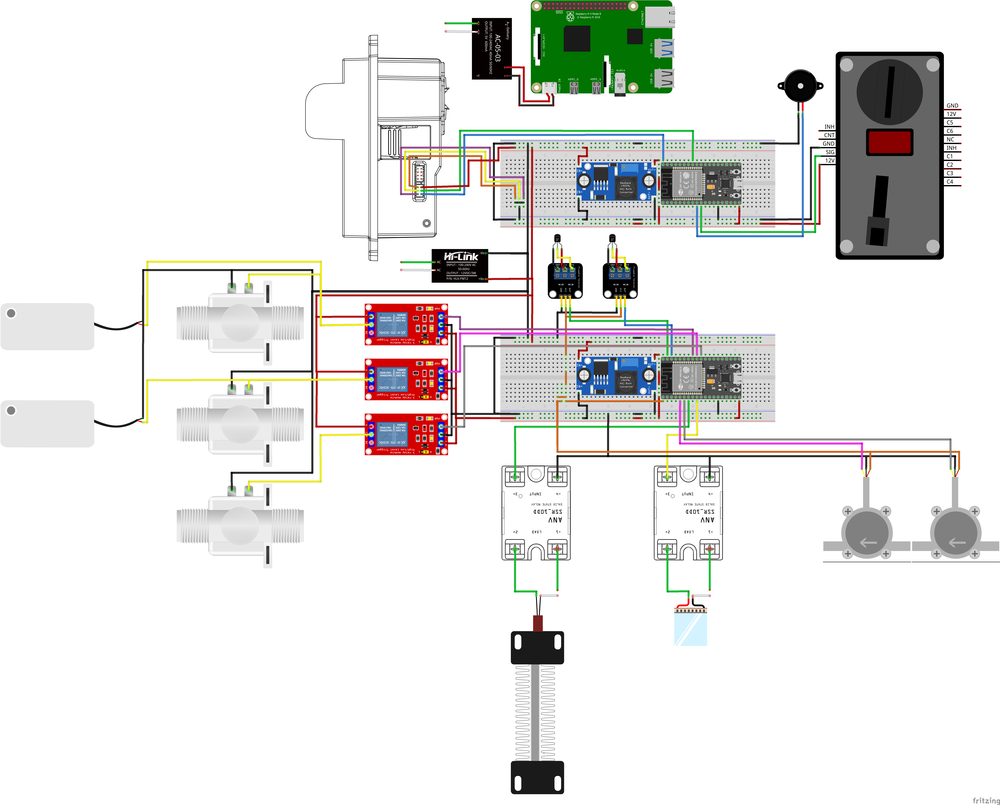
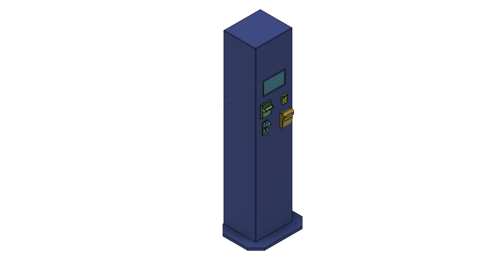
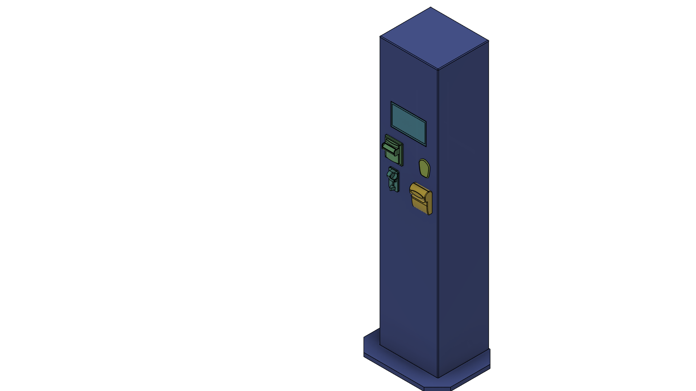

# Water Dispenser Vending Machine

[](https://www.arduino.cc/)
[](https://isocpp.org/)
[](https://www.python.org/)
[](https://github.com/TomSchimansky/CustomTkinter)
[](https://www.raspberrypi.org/)
[](https://opensource.org/licenses/MIT)
[](https://github.com/qppd/water-dispenser-vendo)
[](https://github.com/qppd/water-dispenser-vendo/releases)

## Table of Contents

- [Overview](#overview)
- [Architecture](#architecture)
- [System Diagrams](#system-diagrams)
- [Serial Communication Protocol](#serial-communication-protocol)
- [Features](#features)
- [Hardware Requirements](#hardware-requirements)
- [Software Components](#software-components)
- [Installation](#installation)
- [Usage](#usage)
- [Wiring Diagram](#wiring-diagram)
- [Hardware Models](#hardware-models)
- [Project Structure](#project-structure)
- [Configuration](#configuration)
- [System Integration](#system-integration)
- [Development](#development)
- [Contributing](#contributing)
- [License](#license)
- [Contact](#contact)

## Overview

The Water Dispenser Vending Machine is an automated system designed to dispense water in exchange for coin and bill payments. Built using a dual-ESP32 architecture for the core vending logic and a Raspberry Pi for the user interface, this project demonstrates the integration of embedded systems, payment processing, user management, and real-time sensor monitoring.

The system accepts Philippine currency (coins: P1, P5, P10, P20; bills: P20, P50, P100) through dedicated hardware interfaces, accumulates credits into user accounts, and dispenses water in configurable volumes at three temperature settings (Cold, Warm, Hot). Features include user registration with QR code authentication, points-based rewards for registered users, receipt printing, and real-time monitoring via web dashboard.

This project serves as a comprehensive example of IoT device development, combining hardware interfacing, wireless communication (ESP-Now), cloud synchronization (Firebase), and modern UI design for a practical vending application.

## Architecture

The system follows a distributed architecture with three main components:

### ESP32 Acceptor Node (Payment Gateway)
- **Role**: Handles payment processing and gateway functionality
- **Responsibilities**:
  - Interrupt-driven coin and bill detection
  - Credit accumulation and validation
  - Audio feedback via piezo buzzer
  - Serial communication with Raspberry Pi at 9600 baud
  - ESP-Now wireless communication with Dispenser node
  - Forwards RPI commands to dispenser via ESP-Now

### ESP32 Dispenser Node (Water Control)
- **Role**: Handles water dispensing, temperature control, and sensor monitoring
- **Responsibilities**:
  - Dual flow sensor monitoring for real-time volume tracking
  - Water level sensor for tank monitoring and automatic inlet control
  - Three DS18B20 temperature sensors for hot/warm/cold tanks
  - Three SSR outputs for heater/cooler control (active HIGH)
  - Three relay outputs for solenoid valves and pumps (active LOW)
  - Automatic thermostat control (hot: 83-85°C, cold: 5-7°C)
  - Automatic inlet valve control based on water level
  - ESP-Now wireless communication with Acceptor node
  - Warm water mixing: sequential hot-cold dispense for "warm" temperature

### Raspberry Pi Host (Kiosk Interface)
- **Role**: Provides user interface and system coordination
- **Responsibilities**:
  - Full-screen kiosk UI with CustomTkinter (1024x600)
  - User authentication via Firebase Auth (email/password)
  - Account registration with unique QR code generation
  - Points-based wallet system with tiered rewards (registered vs guest)
  - Serial communication with ESP32 Acceptor at 9600 baud
  - Thermal receipt printing via USB serial (58mm printer)
  - QR code scanner support (USB HID keyboard mode)
  - Offline queue for resilient Firebase Realtime Database sync
  - Web companion app for balance checks and history (Next.js + Firebase)

### Communication Layer
- **ESP-Now**: Peer-to-peer wireless between ESP32 nodes (no WiFi router needed)
- **Serial (USB)**: Raspberry Pi ↔ ESP32 Acceptor at 9600 baud
- **Firebase**: Cloud sync for user accounts, points balance, and transaction history
- **Message Protocol**: `RPI:COMMAND:VALUE` (inbound), `ESP:COMMAND:VALUE` (outbound), `TEMP:TANK:VALUE` (sensor data)

## System Diagrams

### High-Level System Architecture
```
[User] --> [Coin/Bill Input] --> [ESP32 Acceptor] <--ESP-Now--> [ESP32 Dispenser] --> [Dispensing Hardware]
       |                              |                                           |
       |                              |                                           ├── Relays (Valves/Pumps)
       |                              |                                           ├── SSR (Heaters/Cooler)
       |                              |                                           ├── Flow Sensors (x2)
       |                              |                                           ├── Temperature Sensors (x3)
       |                              |                                           └── Water Level Sensor
       |                              |
       v                              v
[Display/Touch] <------------- [Raspberry Pi] <-----USB Serial
                                     |
                                     ├── Firebase (Users/Points/History)
                                     ├── Thermal Printer (Receipts)
                                     └── QR Scanner (Auth Codes)
```

### Hardware Block Diagram - ESP32 Acceptor
```
ESP32 DevKitC (Acceptor Node)
├── GPIO 33: Coin Slot Signal
├── GPIO 12: Coin Slot Enable
├── GPIO 26: Bill Acceptor Signal
├── GPIO 27: Bill Acceptor Enable
├── GPIO 23: Buzzer PWM Output
└── USB: Serial to Raspberry Pi (9600 baud)
```

### Hardware Block Diagram - ESP32 Dispenser
```
ESP32 DevKitC (Dispenser Node)
├── OUTPUTS ──────────────────────────────────────
│   ├── GPIO 32: SSR1 (HEATER1)
│   ├── GPIO 33: SSR2 (HEATER2)
│   ├── GPIO 25: SSR3 (COOLER1)
│   ├── GPIO 19: RELAY1 (Cold Valve + Pump)
│   ├── GPIO 18: RELAY2 (Inlet Valve - Tank Fill)
│   └── GPIO 5:  RELAY3 (Hot Valve + Pump)
├── INPUTS ───────────────────────────────────────
│   ├── GPIO 39: Flow Sensor 1
│   ├── GPIO 35: Flow Sensor 2
│   ├── GPIO 34: Water Level Sensor (Analog)
│   ├── GPIO 23: DS18B20 #1 (Hot Tank)
│   ├── GPIO 22: DS18B20 #2 (Warm Tank)
│   └── GPIO 21: DS18B20 #3 (Cold Tank)
└── ESP-Now: Wireless to Acceptor Node
```

### Raspberry Pi Peripheral Connections
```
Raspberry Pi 4
├── USB Port 1: ESP32 Acceptor (Serial @ 9600 baud)
│   └── /dev/esp_acceptor (udev symlink: VID 10c4, PID ea60)
├── USB Port 2: Thermal Printer (Serial)
│   └── /dev/thermal_printer (udev symlink: VID 0416, PID 5011)
├── USB Port 3: QR Scanner (USB HID keyboard mode)
│   └── Creates keyboard events for scanned QR codes
└── Ethernet/WiFi: Internet for Firebase Cloud sync
```

## Serial Communication Protocol

The system uses a simple text-based serial protocol at 9600 baud for communication between ESP32 Acceptor and Raspberry Pi. ESP-Now is used between the two ESP32 nodes.

### Acceptor Serial Protocol (Raspberry Pi ↔ ESP32 Acceptor)

#### Payment Events (Acceptor → Raspberry Pi)
- **Coin Acceptance**: `Coin accepted: P<VALUE> | Coin Credit: P<TOTAL>`
- **Bill Acceptance**: `Bill accepted: P<VALUE> | Bill Credit: P<TOTAL>`

#### Control Commands (Raspberry Pi → Acceptor)
- `ENABLE COIN` / `DISABLE COIN` - Enable/disable coin slot
- `ENABLE BILL` / `DISABLE BILL` - Enable/disable bill acceptor
- `RESET COIN` / `RESET BILL` - Clear accumulated credits
- `BUZZ <freq> <ms>` - Play tone (e.g., `BUZZ 1200 500`)
- `STATUS` - Get current credits and enable states

#### ESP-Now Forward Commands (Raspberry Pi → Acceptor → Dispenser)
- `RPI:RELAY1:<ms>` - Open cold valve for milliseconds
- `RPI:RELAY3:<ms>` - Open hot valve for milliseconds
- `RPI:WARM:<ms>` - Dispense warm water (sequential hot/cold mix)
- `RPI:SSR1:ON/OFF` - Control heater 1
- `RPI:SSR2:ON/OFF` - Control heater 2
- `RPI:SSR3:ON/OFF` - Control cooler
- `RPI:INLET:ON/OFF` - Control inlet valve manually
- `RPI:STOP:0` - Emergency stop all dispensing
- `RPI:PING:1` - Test ESP-Now connectivity

### ESP-Now Protocol (Acceptor ↔ Dispenser)

#### Dispenser to Acceptor Messages
- `ESP:DONE:RELAY1` - Cold dispense complete
- `ESP:DONE:RELAY3` - Hot dispense complete
- `ESP:DONE:WARM` - Warm dispense complete
- `ESP:FLOW1:<L/min>` - Flow rate sensor 1
- `ESP:VOL1:<mL>` - Total volume dispensed (sensor 1)
- `ESP:FLOW2:<L/min>` - Flow rate sensor 2
- `ESP:VOL2:<mL>` - Total volume dispensed (sensor 2)
- `ESP:WATER:1/0` - Water level present/not present
- `ESP:INLET:CLOSED_AUTO` - Inlet auto-closed (tank full)
- `ESP:INLET:OPEN_AUTO` - Inlet auto-opened (tank needs filling)

#### Temperature Broadcasts (every 5 seconds)
- `TEMP:HOT:<value>` - Hot tank temperature in Celsius
- `TEMP:WARM:<value>` - Warm tank temperature in Celsius
- `TEMP:COLD:<value>` - Cold tank temperature in Celsius

### Example Communication Sequence
```
User inserts P5 coin:
  ESP32-Acceptor → RPi: "Coin accepted: P5 | Coin Credit: P5"

User orders 500ml Cold:
  RPi → ESP32-Acceptor: "RPI:RELAY1:30000" (30 seconds based on flow rate)
  ESP32-Acceptor → ESP32-Dispenser: "RPI:RELAY1:30000" (via ESP-Now)
  ESP32-Dispenser → ESP32-Acceptor: "ESP:DONE:RELAY1" (via ESP-Now)
  ESP32-Acceptor → RPi: "ESP:DONE:RELAY1"
```

## Features

### Payment & Rewards
- **Coin Acceptance**: Supports P1, P5, P10, P20 via ALLAN coin slot (pulse-based)
- **Bill Acceptance**: Supports P20, P50, P100 via TB-74 bill acceptor
- **Points System**: Tiered rewards - guests get 1:1, registered users get bonus rates
  - P1 = 1 pt | P5 = 6 pts | P10 = 13 pts | P20 = 25 pts | P50 = 60 pts | P100 = 115 pts
- **Activation Fee**: P10 fee to activate registered account (converted to points)
- **Welcome Bonus**: New registered users receive 10 free points

### Water Dispensing
- **Three Temperatures**: Cold, Warm (hot-cold mixed), Hot
- **Four Volumes**: 100ml, 250ml, 500ml, 1000ml
- **Pricing Tiers**:
  - Registered: 100ml=1pt, 250ml=2pt, 500ml=4pt, 1000ml=8pt
  - Guest: 100ml=1pt, 250ml=3pt, 500ml=5pt, 1000ml=10pt
- **Temperature Control**: Automatic thermostat for hot (83-85°C) and cold (5-7°C)
- **Water Level Monitoring**: Automatic inlet valve control (open when low, close when full)

### User Management
- **Guest Mode**: Quick access without registration
- **User Registration**: Account creation with username, email, phone, password
- **QR Code Authentication**: Users can scan QR code instead of typing credentials
- **Firebase Integration**: Cloud-based user accounts, points balance, transaction history
- **Web Dashboard**: Next.js companion app for checking balance and history remotely

### Hardware Interface
- **Full-Screen Kiosk UI**: CustomTkinter-based touch interface
- **Thermal Printing**: 58mm receipts for transactions
- **QR Scanner**: USB HID keyboard-mode scanner for quick login
- **Offline Support**: Local queue for Firebase operations when network is unavailable
- **Serial Event Handling**: Real-time hardware event processing with callback system

## Hardware Requirements

### ESP32 Acceptor Node
- ESP32 Development Board (ESP32-DevKitC recommended)
- ALLAN Coin Slot (pulse-based, enable pin required)
- TB-74 Bill Acceptor (pulse-based, enable pin required)
- Piezo Buzzer for audio feedback
- USB cable for serial connection to Raspberry Pi

### ESP32 Dispenser Node
- ESP32 Development Board (ESP32-DevKitC recommended)
- Three 5V Relay Modules (active LOW) for solenoid valves and pumps
- Three SSR Modules (active HIGH) for heaters and cooler
- Two YF-S201 Hall Effect Flow Sensors
- MakerLab Rain/Water Level Sensor (analog output)
- Three DS18B20 Waterproof Temperature Sensors
- Solenoid valves and water pumps
- Heating elements and cooling compressor

### Raspberry Pi Host
- Raspberry Pi 4 Model B (4GB RAM recommended)
- Official 7" Touchscreen Display (1024x600)
- MicroSD Card (32GB minimum, Class 10)
- USB Thermal Receipt Printer (58mm, serial interface)
- USB QR Code Scanner (HID keyboard mode compatible)
- USB WiFi adapter (if not using Pi 4 built-in WiFi)
- Power supply (5V 3A for Pi, appropriate for peripherals)

### Pin Configuration

| Component | ESP32 Pin | Description |
|-----------|-----------|-------------|
| **Acceptor Node** |||
| Coin Signal | GPIO 33 | Pulse input from coin slot |
| Coin Enable | GPIO 12 | Enable/disable coin slot |
| Bill Signal | GPIO 26 | Pulse input from bill acceptor |
| Bill Enable | GPIO 27 | Enable/disable bill acceptor |
| Buzzer | GPIO 23 | PWM output for audio feedback |
| **Dispenser Node** |||
| SSR1 (Heater1) | GPIO 32 | Boiler heater control |
| SSR2 (Heater2) | GPIO 33 | Tank heater control |
| SSR3 (Cooler) | GPIO 25 | Cooling compressor control |
| RELAY1 | GPIO 19 | Cold water valve + pump |
| RELAY2 | GPIO 18 | Inlet solenoid valve |
| RELAY3 | GPIO 5 | Hot water valve + pump |
| Flow Sensor 1 | GPIO 39 | Cold side flow measurement |
| Flow Sensor 2 | GPIO 35 | Hot side flow measurement |
| Water Level | GPIO 34 | Analog water level detection |
| DS18B20 #1 | GPIO 23 | Hot tank temperature |
| DS18B20 #2 | GPIO 22 | Warm tank temperature |
| DS18B20 #3 | GPIO 21 | Cold tank temperature |

## Software Components

### ESP32 Firmware Requirements
- Arduino IDE 1.8.x or later / VS Code with PlatformIO
- ESP32 Board Support Package (version 2.0.0 or higher)
- Required Libraries:
  - `WiFi.h` (built-in)
  - `esp_now.h` (built-in)
  - `OneWire` (for DS18B20 sensors)
  - `DallasTemperature` (for DS18B20 sensors)

### Raspberry Pi Host Requirements
- Raspberry Pi OS (64-bit, Desktop)
- Python 3.11 or higher
- pip package manager

### Raspberry Pi Dependencies (requirements.txt)
```
customtkinter>=5.2.0
pyserial>=3.5
qrcode[pil]>=7.0
Pillow>=9.0
pyrebase4>=4.6.0
firebase-admin>=6.3.0
```

### Web Dashboard Requirements
- Node.js 18+ and npm
- Next.js 14
- Firebase SDK 10+

### Development Tools
- Git for version control
- VS Code with Arduino extension
- PlatformIO (alternative to Arduino IDE)
- Fritzing for circuit design (optional)

## Project Structure

```
water-dispenser-vendo/
├── LICENSE
├── README.md
├── src/
│   ├── esp/
│   │   ├── ESPWDV/                    # Dispenser ESP32 (water control)
│   │   │   ├── ESPWDV.ino            # Main dispenser sketch
│   │   │   ├── PINS_CONFIG.h         # Pin definitions
│   │   │   ├── RELAY_CONFIG.h/.cpp   # Relay and SSR control
│   │   │   ├── FLOW_SENSOR.h/.cpp    # Flow sensor handling
│   │   │   ├── WATER_LEVEL_SENSOR.h/.cpp  # Water level monitoring
│   │   │   └── DS18B20_SENSOR.h/.cpp # Temperature sensors
│   │   └── ESPWDVAcceptor/            # Acceptor ESP32 (payment)
│   │       ├── ESPWDVAcceptor.ino    # Main acceptor sketch
│   │       ├── PINS_CONFIG.h         # Pin definitions
│   │       ├── COIN_SLOT.h/.cpp      # Coin slot interface
│   │       ├── BILL_ACCEPTOR.h/.cpp   # Bill acceptor interface
│   │       └── BUZZER_CONFIG.h/.cpp  # Buzzer control
│   ├── rpi/
│   │   └── WDVHost/                   # Raspberry Pi kiosk application
│   │       ├── main.py               # Entry point (ABC Splash Kiosk)
│   │       ├── config.py             # Hardware configuration
│   │       ├── app_state.py          # Application state management
│   │       ├── serial_manager.py     # Serial communication with ESP32
│   │       ├── serial_second_esp.py  # Secondary ESP32 connection
│   │       ├── firebase_config.py    # Firebase Admin SDK config
│   │       ├── firebase_sync.py      # RTDB synchronization
│   │       ├── storage.py            # Local JSON storage
│   │       ├── offline_queue.py      # Offline operation queue
│   │       ├── qr_scanner.py         # USB HID QR scanner handling
│   │       ├── thermal_printer.py    # 58mm receipt printer
│   │       ├── requirements.txt      # Python dependencies
│   │       ├── wdv-kiosk.service     # systemd service file
│   │       ├── start-kiosk.sh        # Startup script
│   │       └── ui/                   # UI components
│   │           ├── theme.py          # Color scheme and dimensions
│   │           ├── base_page.py      # Base page class
│   │           ├── login_page.py     # User login
│   │           ├── register_page.py  # Account registration
│   │           ├── forgot_password_page.py
│   │           ├── home_page.py      # Landing page
│   │           ├── dashboard_page.py # Main account view
│   │           ├── profile_page.py   # User profile management
│   │           ├── history_page.py   # Transaction history
│   │           ├── services_page.py  # Service selection
│   │           ├── temperature_page.py
│   │           ├── volume_page.py    # Volume selection
│   │           ├── topup_choices_page.py
│   │           ├── topup_cash_page.py
│   │           ├── dispensing_page.py
│   │           ├── qr_scan_page.py   # QR code login
│   │           ├── sidebar.py        # Navigation sidebar
│   │           └── keyboard.py       # On-screen keyboard
│   ├── web/
│   │   └── WDVWeb/                    # Next.js companion web app
│   │       ├── src/
│   │       │   ├── app/              # Next.js app router
│   │       │   ├── context/          # Auth context
│   │       │   └── lib/              # Firebase web config
│   │       ├── package.json
│   │       └── tsconfig.json
│   └── sample/                        # Hardware sample code and docs
│       ├── 58MMThermalrecieptprinter/ # Printer SDK and manuals
│       └── thermal-printer/
│           └── requirements.txt
├── diagrams/                          # Circuit diagrams
└── models/                           # 3D printable enclosures
```

## Installation

### 1. Clone the Repository
```bash
git clone https://github.com/qppd/water-dispenser-vendo.git
cd water-dispenser-vendo
```

### 2. ESP32 Firmware Setup

#### Acceptor Node (Payment Gateway)
1. Open `src/esp/ESPWDVAcceptor/ESPWDVAcceptor.ino` in Arduino IDE
2. Install ESP32 board support (Tools > Board > Boards Manager)
3. Select "ESP32 Dev Module" from Tools > Board
4. Set baud rate to 115200 for Serial Monitor
5. Update `dispenserMAC[]` with your ESPWDV MAC address (see Serial Monitor after flashing Dispenser)
6. Upload to ESP32 Acceptor
7. Note the MAC address printed on Serial Monitor

#### Dispenser Node (Water Control)
1. Open `src/esp/ESPWDV/ESPWDV.ino` in Arduino IDE
2. Update `acceptorMAC[]` with your ESPWDVAcceptor MAC address
3. Upload to ESP32 Dispenser
4. Open Serial Monitor (115200 baud) and type `MAC` to get the MAC address
5. Use this to update the Acceptor node

### 3. Raspberry Pi Setup

#### Install System Dependencies
```bash
# Update system
sudo apt update && sudo apt upgrade -y

# Install Python and dependencies
sudo apt install python3-pip python3-venv -y

# Install required libraries for tkinter and USB
sudo apt install python3-tk python3-pil python3-pil.imagetk -y

# Create udev rules for USB devices
sudo nano /etc/udev/rules.d/99-wdv-devices.rules
```

Add these lines (adjust VID/PID as needed):
```
# ESP32 Acceptor (Silicon Labs CP2102)
SUBSYSTEM=="tty", ATTRS{idVendor}=="10c4", ATTRS{idProduct}=="ea60", SYMLINK+="esp_acceptor", MODE="0666"

# Thermal Printer (Winbond Virtual Com Port)
SUBSYSTEM=="tty", ATTRS{idVendor}=="0416", ATTRS{idProduct}=="5011", SYMLINK+="thermal_printer", MODE="0666"
```

Reload udev rules:
```bash
sudo udevadm control --reload-rules
sudo udevadm trigger
```

#### Install Python Application
```bash
cd src/rpi/WDVHost

# Create virtual environment
python3 -m venv venv
source venv/bin/activate

# Install dependencies
pip install -r requirements.txt

# Configure your Firebase credentials
# Edit firebase_config.py with your Firebase Admin SDK credentials
```

### 4. Web Dashboard Setup (Optional)

```bash
cd src/web/WDVWeb

# Install dependencies
npm install

# Configure Firebase
# Edit src/lib/firebase.ts with your Firebase web config

# Run development server
npm run dev

# Build for production
npm run build
```

### 5. Systemd Service Setup (Production)

```bash
# Copy service file
sudo cp src/rpi/WDVHost/wdv-kiosk.service /etc/systemd/system/

# Edit paths in service file if needed
sudo nano /etc/systemd/system/wdv-kiosk.service

# Enable and start service
sudo systemctl daemon-reload
sudo systemctl enable wdv-kiosk.service
sudo systemctl start wdv-kiosk.service

# View logs
sudo journalctl -u wdv-kiosk -f
```

## Configuration

### ESP32 Pin Configuration

Edit `PINS_CONFIG.h` in each ESP32 project to match your wiring:

#### ESPWDVAcceptor/src/ESPWDVAcceptor/PINS_CONFIG.h
```cpp
// Coin Slot
#define COIN_PIN 33
#define COIN_ENABLE_PIN 12

// Bill Acceptor
#define BILL_PIN 26
#define BILL_ENABLE_PIN 27

// Piezo Buzzer
#define BUZZER_PIN 23
```

#### ESPWDV/src/ESPWDV/PINS_CONFIG.h
See [PINS_CONFIG.h](src/esp/ESPWDV/PINS_CONFIG.h) for complete pinout.

### Raspberry Pi Configuration

Edit `src/rpi/WDVHost/config.py`:

```python
# Thermal printer port
# "auto" for auto-detect, or explicit port like "/dev/thermal_printer"
PRINTER_PORT: str = "/dev/thermal_printer"

# ESP32 Acceptor serial port
ESP_ACCEPTOR_PORT: str = "/dev/esp_acceptor"

# ESP32 Dispenser direct USB (optional, for debugging ESP-Now)
# Set to "" to disable (normal operation)
ESP_DISPENSER_PORT: str = ""
```

### Pricing and Rewards

Edit `src/rpi/WDVHost/app_state.py`:

```python
# Registered user rates (points per peso)
REGISTERED_RATES = {1: 1, 5: 6, 10: 13, 20: 25, 50: 60, 100: 115}

# Pricing for registered users
PRICING_REGISTERED = [
    {"ml": 100, "cost": 1},
    {"ml": 250, "cost": 2},
    {"ml": 500, "cost": 4},
    {"ml": 1000, "cost": 8},
]

# Pricing for guests
PRICING_GUEST = [
    {"ml": 100, "cost": 1},
    {"ml": 250, "cost": 3},
    {"ml": 500, "cost": 5},
    {"ml": 1000, "cost": 10},
]

# Pump flow rate (L/min) - used to calculate relay timing
PUMP_FLOW_RATE = 1.0  # Adjust based on actual pump calibration

# Activation fee and welcome bonus
ACTIVATION_FEE = 10
WELCOME_BONUS = 10
```

### Firebase Setup

1. Create a Firebase project at [console.firebase.google.com](https://console.firebase.google.com)
2. Enable Authentication (Email/Password)
3. Create a Realtime Database
4. Download Admin SDK service account key (for RPi)
5. Get Web API config (for web dashboard)
6. Update `firebase_config.py` and `firebase.ts` with your credentials

## Usage

### Running the Kiosk

#### Development Mode (with hardware simulation)
```bash
cd src/rpi/WDVHost
source venv/bin/activate
python main.py --sim
```

#### Production Mode
```bash
# Via systemd
sudo systemctl start wdv-kiosk

# Or manually
cd src/rpi/WDVHost
source venv/bin/activate
python main.py
```

### User Flow

1. **Landing Page**: User chooses Guest or Login/Register
2. **Guest Mode**: Direct to service selection (higher pricing)
3. **Login**: Username/password or scan QR code
4. **Dashboard**: View balance, history, select service
5. **Service Selection**: Choose water temperature
6. **Volume Selection**: Choose volume (cost displayed)
7. **Confirm**: Review order and confirm
8. **Dispensing**: Water dispenses automatically
9. **Receipt**: Optional thermal print

### Top-Up Flow

1. Select "Top Up" from dashboard or sidebar
2. Insert coins or bills (credits accumulate in real-time)
3. Press "Done" to convert cash to points
4. Points added to user's balance
5. Transaction logged to Firebase

### Registration Flow

1. Select "Register" from home page
2. Fill in username, email, phone, password
3. Insert P10 (activation fee) - converted to points
4. Account created with welcome bonus
5. QR code generated for quick login
6. Print QR code on receipt (optional)

## Wiring Diagram

Refer to the `diagrams/` directory for detailed wiring diagrams.



### Basic Connections

#### ESP32 Acceptor to Coin/Bill Acceptors
```
Coin Slot (ALLAN):
  - Signal → GPIO 33 (with 10k pull-up)
  - Enable → GPIO 12
  - GND → ESP32 GND
  - VCC → 12V power supply

Bill Acceptor (TB-74):
  - Signal → GPIO 26 (with 10k pull-up)
  - Enable → GPIO 27
  - GND → ESP32 GND
  - VCC → 12V power supply
  - USB → Hidden (maintenance only)

Buzzer:
  - Positive → GPIO 23
  - Negative → ESP32 GND
```

#### ESP32 Dispenser to Sensors and Outputs
```
DS18B20 Temperature Sensors:
  - Data (x3) → GPIO 23, 22, 21 (one-wire per sensor)
  - VCC → 3.3V
  - GND → ESP32 GND
  - 4.7k pull-up on each data line

Flow Sensors (YF-S201):
  - Signal → GPIO 39, 35
  - VCC → 5V
  - GND → ESP32 GND

Water Level Sensor (MakerLab analog):
  - Signal → GPIO 34
  - VCC → 3.3V
  - GND → ESP32 GND

Relays (active LOW):
  - Control → GPIO 19, 18, 5
  - VCC → 5V
  - GND → ESP32 GND

SSRs (active HIGH):
  - Control → GPIO 32, 33, 25
  - VCC/GND → appropriate SSR driver circuit
```

#### Raspberry Pi Connections
```
USB Devices:
  - USB Port with ESP32 → ESP32 Acceptor
  - USB Port with Serial → Thermal Printer
  - USB Port with HID → QR Scanner

Display:
  - Official 7" Touchscreen → DSI + GPIO power

Network:
  - Ethernet or WiFi for Firebase connectivity
```

⚠️ **Safety Note**: Ensure proper power isolation between control circuits (3.3V/5V) and high-power components (heaters, pumps at 220V/110V). Use SSRs and relays rated for your mains voltage and current.

## Hardware Models

The project includes 3D models and CAD files for custom hardware components. These can be found in the `models/` directory.

### 3D Model Images

<div align="center">


</div>

### Available Models
- **Enclosure Design**: 3D printable case for the vending machine
- **Mounting Brackets**: Custom brackets for hardware components
- **Adapter Plates**: Interface plates for different hardware configurations

### File Formats
- STL files for 3D printing
- STEP files for CAD software
- Fritzing files for circuit prototyping

### Usage
1. Download the appropriate model files from the `models/` directory
2. Open in your preferred CAD software or 3D printing application
3. Modify as needed for your specific requirements
4. Print or manufacture the components

## API Reference

### Serial Commands (ESP32 Acceptor)

#### Acceptor Control
| Command | Description |
|---------|-------------|
| `ENABLE COIN` | Enable coin slot acceptance |
| `DISABLE COIN` | Disable coin slot acceptance |
| `ENABLE BILL` | Enable bill acceptor acceptance |
| `DISABLE BILL` | Disable bill acceptor acceptance |
| `RESET COIN` | Clear accumulated coin credit |
| `RESET BILL` | Clear accumulated bill credit |
| `BUZZ <f> <ms>` | Play tone at frequency f Hz for ms milliseconds |
| `BUZZ OFF` | Stop buzzer immediately |
| `STATUS` | Print current credits and enable states |
| `MAC` | Print ESP32 WiFi MAC address |
| `PING` | Send ESP-Now ping to Dispenser |
| `HELP` | Show available commands |

#### Dispenser Control (forwarded via ESP-Now)
| Command | Description | Example |
|---------|-------------|---------|
| `RPI:RELAY1:<ms>` | Open cold valve for ms | `RPI:RELAY1:30000` |
| `RPI:RELAY2:<ms>` | Open inlet valve for ms | `RPI:RELAY2:5000` |
| `RPI:RELAY3:<ms>` | Open hot valve for ms | `RPI:RELAY3:30000` |
| `RPI:WARM:<ms>` | Dispense warm water | `RPI:WARM:17143` |
| `RPI:SSR1:ON/OFF` | Control heater 1 | `RPI:SSR1:ON` |
| `RPI:SSR2:ON/OFF` | Control heater 2 | `RPI:SSR2:ON` |
| `RPI:SSR3:ON/OFF` | Control cooler | `RPI:SSR3:ON` |
| `RPI:INLET:ON/OFF` | Manual inlet valve | `RPI:INLET:ON` |
| `RPI:INLET_AUTO:1/0` | Auto inlet mode | `RPI:INLET_AUTO:1` |
| `RPI:STOP:0` | Emergency stop all | `RPI:STOP:0` |

### Python AppState API (Raspberry Pi)

```python
# User management
app_state.login(user)           # Log in user
app_state.logout()              # Log out current user
app_state.login_guest()         # Switch to guest mode

# Points
app_state.add_cash(pesos)       # Convert and add points
app_state.deduct_points(pts, desc)  # Spend points
app_state.user.points           # Current balance

# Transaction history
app_state.add_transaction(desc, delta)  # Add to history
app_state.history               # List of transactions

# Callbacks (for UI pages)
app_state.register_coin_callback(fn)      # fn(value)
app_state.register_bill_callback(fn)      # fn(value)
app_state.register_dispense_complete_callback(fn)  # fn()
app_state.register_qr_callback(fn)        # fn(data)

# Hardware events (from SerialManager)
app_state.dispatch_coin(value)
app_state.dispatch_bill(value)
app_state.dispatch_dispense_complete()
app_state.dispatch_qr_scanned(data)
```

## Troubleshooting

### Common Issues

#### No Coin/Bill Detection
- Check wiring connections (pull-up resistors required)
- Verify interrupt pins are correct in PINS_CONFIG.h
- Test with multimeter for signal pulses
- Ensure coin/bill acceptor power supply is adequate (12V)
- Check ENABLE pins are HIGH

#### ESP-Now Communication Fails
- Verify MAC addresses are correctly configured in both ESP32s
- Flash both ESP32s and check Serial Monitor MAC output
- Ensure distance between ESP32s is within range (~100m line-of-sight)
- Check WiFi channel interference

#### Incorrect Denomination Detection
- Adjust pulse counting logic in COIN_SLOT.cpp or BILL_ACCEPTOR.cpp
- Check acceptor calibration (pulse count per denomination)
- Verify timing parameters (debounce delays)

#### Buzzer Not Working
- Check GPIO 23 connection
- Verify buzzer is active type (or add transistor driver)
- Test with simple tone sketch: `playTone(1200, 500)`

#### Relay Not Activating
- Relays are active LOW - send LOW to activate
- Check GPIO connections
- Verify relay power supply
- Test relay module independently

#### Thermal Printer Not Printing
- Check udev rules are loaded: `ls -la /dev/thermal_printer`
- Verify printer baud rate (typically 9600 or 19200)
- Check paper and printer power
- View logs: `journalctl -u wdv-kiosk -f`

#### QR Scanner Not Working
- Ensure scanner is in HID keyboard mode (not serial mode)
- Check scanner appears in `lsusb`
- Test by scanning to a text file
- Some scanners require configuration barcode to enable keyboard mode

#### Firebase Sync Issues
- Check internet connectivity
- Verify Firebase credentials in firebase_config.py
- View offline queue: check app logs for queue status
- Check Firebase rules allow read/write for your paths

### Debug Mode

Enable detailed logging:

```python
# In logger_config.py, set level to DEBUG
logging.basicConfig(level=logging.DEBUG)
```

View serial communication:
```bash
# Direct serial monitor
picocom -b 9600 /dev/esp_acceptor

# Or use minicom
minicom -D /dev/esp_acceptor -b 9600
```

### Test Scripts

The repository includes test scripts in `src/rpi/WDVHost/`:

```bash
# Test water level sensor
python test_water_level.py /dev/ttyUSB0

# Test thermal printer
python -c "from thermal_printer import ThermalPrinter; p = ThermalPrinter(); p.test_page()"

# Test serial communication
python -c "from serial_manager import SerialManager; sm = SerialManager(); sm.write('STATUS')"
```

## System Integration

### ESP32 and Raspberry Pi Integration
The system integrates ESP32 firmware with Raspberry Pi host software through serial communication. ESP-Now handles wireless communication between the two ESP32 nodes. The ESP32 Acceptor handles real-time hardware interactions while the Raspberry Pi provides user interface, cloud connectivity, and system coordination.

### Hardware Integration
- **Power Management**: Separate power supplies for control circuits (5V/3.3V) and high-power components (220V/110V)
- **Signal Isolation**: Optocouplers recommended for acceptor outputs
- **Grounding**: Proper grounding to prevent noise and ensure reliable operation
- **EMI Protection**: Ferrite beads on long sensor cables recommended

### Software Integration
- **Serial Protocol**: Standardized message format for reliable data exchange
- **Queue-Based Events**: Thread-safe event queue prevents UI blocking
- **Offline Resilience**: Local storage + Firebase sync queue maintains operation without internet
- **Error Handling**: Comprehensive error logging and recovery mechanisms
- **State Machine**: Payment state controls when coin/bill events are processed

## Development

### Development Environment Setup

#### Arduino IDE Setup (ESP32)
1. Install Arduino IDE 1.8.x or 2.x
2. Add ESP32 board support: `https://dl.espressif.com/dl/package_esp32_index.json`
3. Install libraries: Sketch > Include Library > Manage Libraries
4. Required: OneWire, DallasTemperature

#### VS Code + PlatformIO (Alternative)
```bash
# PlatformIO is recommended for multi-file ESP32 projects
# Install PlatformIO extension in VS Code
# Open the ESP32 folder as a PlatformIO project
```

#### Raspberry Pi Development
```bash
# Create virtual environment
python3 -m venv venv
source venv/bin/activate

# Install in editable mode (for development)
pip install -e .

# Run with simulation flag for UI development without hardware
python main.py --sim
```

### Testing Procedures

#### Unit Testing
Test individual hardware components:
- **Water Level Sensor**: Run `python test_water_level.py /dev/esp_acceptor`
- **Flow Sensors**: Use `FLOW1` or `FLOW2` commands in ESP32 Dispenser serial monitor
- **Temperature Sensors**: Use `TEMP` command in ESP32 Dispenser serial monitor
- **Relays**: Use `R1 ON`, `R2 ON`, `R3 ON` commands
- **SSRs**: Use `SSR1 ON`, `SSR2 ON`, `SSR3 ON` commands

#### Integration Testing
- Verify ESP32-Raspberry Pi serial communication
- Test ESP-Now between Acceptor and Dispenser (use `PING` command)
- Test coin/bill detection and credit accumulation
- Test flow sensors with actual water flow

#### System Testing
- End-to-end testing with actual currency
- Test all temperature/volume combinations
- Verify QR code scanning and login
- Test receipt printing
- Verify Firebase sync (online/offline scenarios)

### Code Quality
- Follow Arduino coding standards for ESP32 code
- Use PEP 8 for Python code
- Add comprehensive docstrings for public APIs
- Implement proper error handling with logging
- Use type hints in Python where applicable

### Version Control
- Use Git for source code management
- Follow semantic versioning (SemVer)
- Maintain clear commit messages
- Use feature branches for development
- Tag releases: `git tag -a v1.0.0 -m "Release 1.0.0"`

## Contributing

1. Fork the repository
2. Create a feature branch (`git checkout -b feature/AmazingFeature`)
3. Commit your changes (`git commit -m 'Add some AmazingFeature'`)
4. Push to the branch (`git push origin feature/AmazingFeature`)
5. Open a Pull Request

### Development Guidelines

- Follow Arduino coding standards (camelCase for ESP32)
- Follow PEP 8 for Python (snake_case)
- Add comments for complex logic but keep code self-documenting
- Test hardware changes thoroughly before committing
- Update documentation for new features
- Ensure backward compatibility when possible

## License

This project is licensed under the MIT License - see the [LICENSE](LICENSE) file for details.

## Contact

**Project Author**: [qppd](https://github.com/qppd)

For questions, issues, or contributions, please:
- Open an issue on [GitHub](https://github.com/qppd/water-dispenser-vendo/issues)
- Contact via GitHub profile

---

*Built with Arduino, Python, and CustomTkinter. Optimized for Philippine currency.*
